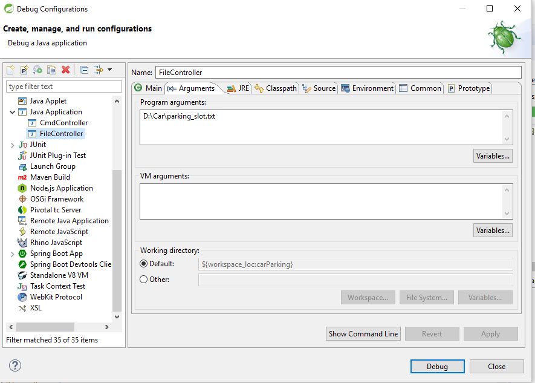

CAR PARKING
==================
The project has run in 2 formats ...

# Run the file Format
* Pass the file name to arguments `args[0]`
* Run as Java Application get the response in console.
* Go to Run -> Debug Configurations set the arguments path file as given    below.

## Run the Commend Format
* Run as Java Application get the response in console.
* Given input as format of below options.  
	 `create_parking_lot <number>` 
	 `park <registerNumber> <colour>` 
	 `leave <number>` 
	 `status <>` 
	 `registration_numbers_for_cars_with_colour <colour>` 
	 `slot_number_for_registration_number <registrationNumber>` 
	 `slot_numbers_for_cars_with_colour <colour>` 
	 `exit <>` 
	 

	 
	 
	 
	 
	 
	 
